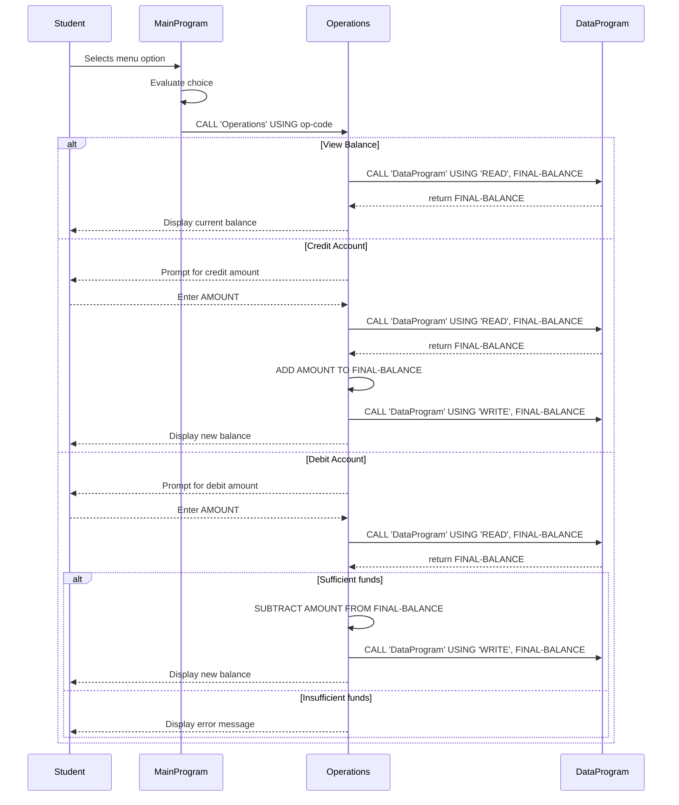

# COBOL Student Account Management Documentation

This documentation explains the purpose of each COBOL source file in the `src/cobol` directory, summarizes the key functions they provide, and highlights the business rules used to manage student account balances.

## Project Overview

The repository contains a simple COBOL account management system built from separate programs for the user interface, business logic, and data handling.

The program lets a student or account holder:
- view current account balance
- credit (deposit) funds to the account
- debit (withdraw) funds from the account
- exit the system

## File Summary

### `src/cobol/main.cob`

Purpose:
- Entry point for the account management application.
- Displays the main menu.
- Accepts user choices and dispatches operations.

Key behavior:
- Shows options for `View Balance`, `Credit Account`, `Debit Account`, and `Exit`.
- Uses `EVALUATE` to route the selected operation.
- Calls the `Operations` program with a 6-character operation code:
  - `TOTAL ` to view balance
  - `CREDIT` to credit funds
  - `DEBIT ` to debit funds
- Ends the loop when the user chooses `4`.

### `src/cobol/operations.cob`

Purpose:
- Implements business logic for credit and debit operations.
- Interacts with the data program to read and write account balances.

Key behavior:
- Receives the operation type from `main.cob`.
- For `TOTAL `:
  - Calls `DataProgram` with `READ` to fetch the current balance.
  - Displays the current balance.
- For `CREDIT`:
  - Prompts the user for a credit amount.
  - Reads the current balance.
  - Adds the credit amount to the balance.
  - Writes the updated balance back through `DataProgram`.
  - Displays the new balance.
- For `DEBIT `:
  - Prompts the user for a debit amount.
  - Reads the current balance.
  - Checks whether sufficient funds exist.
  - If funds are sufficient, subtracts the debit amount and writes the new balance.
  - If funds are insufficient, displays an error message.

### `src/cobol/data.cob`

Purpose:
- Manages the stored account balance.
- Acts as a simple data access layer.

Key behavior:
- Maintains `STORAGE-BALANCE` in working storage.
- For `READ` operations:
  - Moves the stored balance into the passed `BALANCE` parameter.
- For `WRITE` operations:
  - Updates `STORAGE-BALANCE` from the passed `BALANCE` parameter.

## Business Rules for Student Accounts

- The system starts with an initial balance of `1000.00`.
- Credit operations always increase the account balance.
- Debit operations are only allowed when the current balance is greater than or equal to the requested debit amount.
- If a debit would overdraw the account, the system refuses the transaction and displays `Insufficient funds for this debit.`
- Balance operations are centralized in `DataProgram` so both read and write access share the same stored balance.

## Notes

- The COBOL programs are organized into a simple modular structure:
  - `main.cob` handles user input and menu flow.
  - `operations.cob` contains the business rules for balance changes.
  - `data.cob` stores and returns the account balance.
- The current implementation uses a single in-memory balance variable in `DataProgram`; it is not persisted to an external file or database.

## Sequence Diagram

